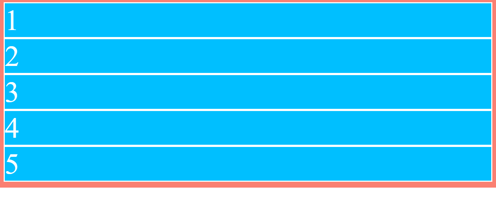
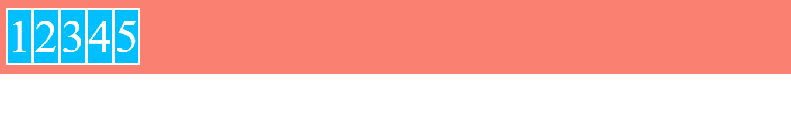
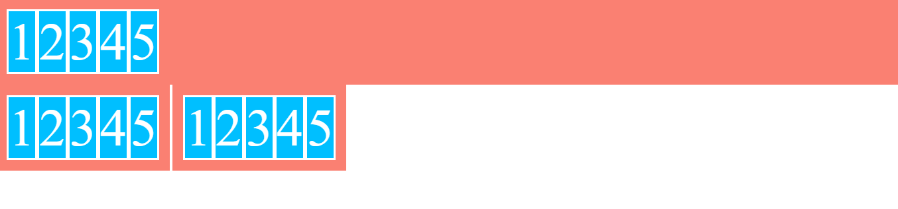

# Ejemplo de introducción: display: flex y display: inline-flex

## display: flex

En el ejemplo inicialmente partimos de una caja ".flex-container" contenedora de 5 elementos de bloque ".flex-item" con números correlativos en su interior:



```html
<div class="flex-container">
    <div class="flex-item">1</div>
    <div class="flex-item">2</div>
    <div class="flex-item">3</div>
    <div class="flex-item">4</div>
    <div class="flex-item">5</div>
</div>
```

```scss
.flex-container {
    background-color: salmon;
    color: white;
    padding: 1em;
}

.flex-item {
    font-size: 5em;
    background-color: deepskyblue;
    border: 3px solid;
}
```

Solo con aplicar la propiedad **display: flex** mediante otra clase, al elemento contenedor, la disposición de los elementos quedará de la siguiente forma



```html
<div class="flex-container flex">
    ...
</div>
```

```scss
.flex {
    display: flex;
}
```

Los elementos hijos del contenedor se disponen a lo largo del eje principal, ([ver README de la sección](../)), estos items ocuparán lo que ocupa su contenido

## display: inline-flex
En un segundo paso añadimos un nuevo contenedor con cinco elementos en bloque en su interior, identico al anterior pero con la clase .inline-flex

```html
<div class="flex-container inline-flex">
    ...
</div>
```

```scss
.inline-flex {
    display: inline-flex;
}
```

En este caso la diferencia más evidente es que, el segundo elemento contenedor pasa a comportarse como un elemento inline-block, mientras que el primero se comporta como un elemento de bloque, independientemente del comportamiento que tengan los elementos en su interior


