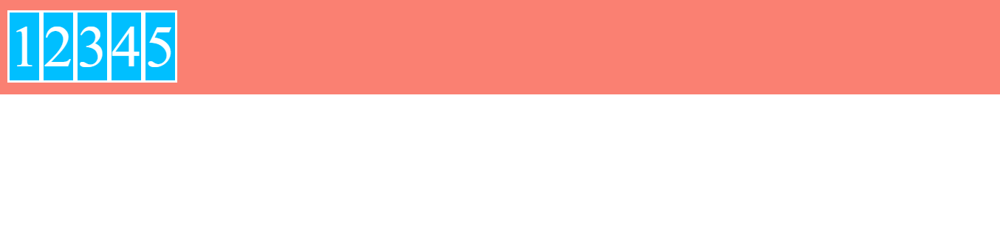
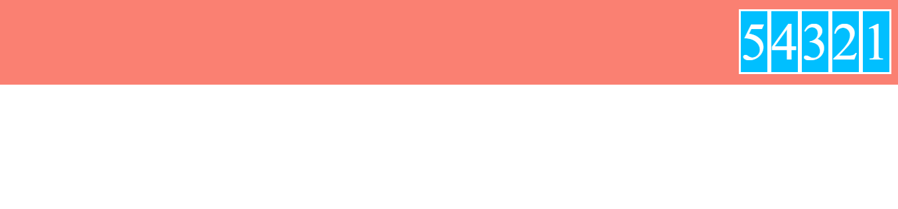
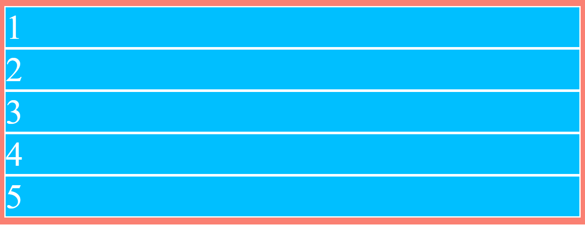
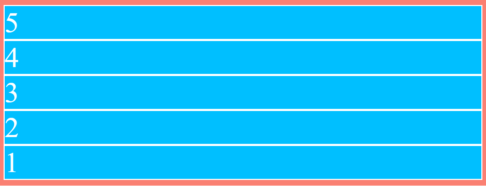

# Valores de flex-direction

- flex-direction: row

```scss
.flex-container {
    ...
    display: flex;
    flex-direction: row;
}
```



- flex-direction: row-reverse

```scss
.flex-container {
    ...
    display: flex;
    flex-direction: row-reverse;
}
```



- flex-direction: column

```scss
.flex-container {
    ...
    display: flex;
    flex-direction: column;
}
```



Ya que la propiedad **display: flex**, sobre el contenedor hace que este se disponga como un elemento de bloque, los items ocupan todo el espacio disponible en el ancho ya que su valor por defecto en la propiedad **align-items** es **stretch**
A diferencia de **flex-direction: row** en donde los items solo ocupan el alto del contenido y por tanto la propiedad **align-items: stretch** no se aprecia

- flex-direction: column-reverse

```scss
.flex-container {
    ...
    display: flex;
    flex-direction: column-revese;
}
```


