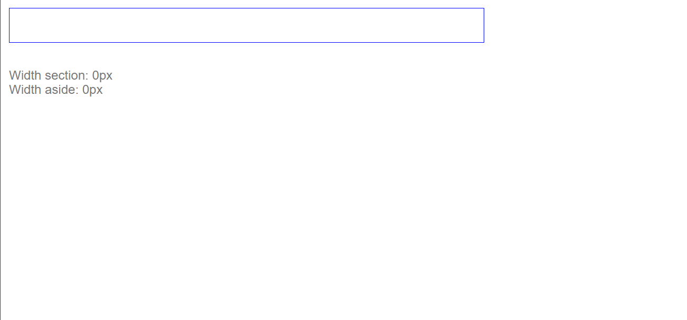
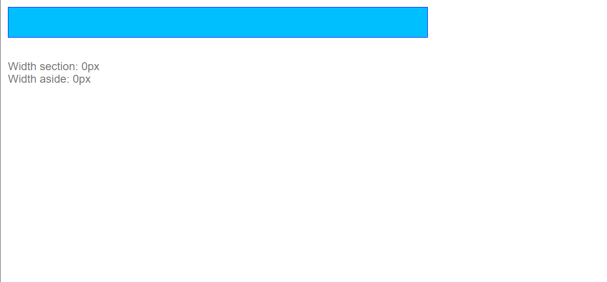
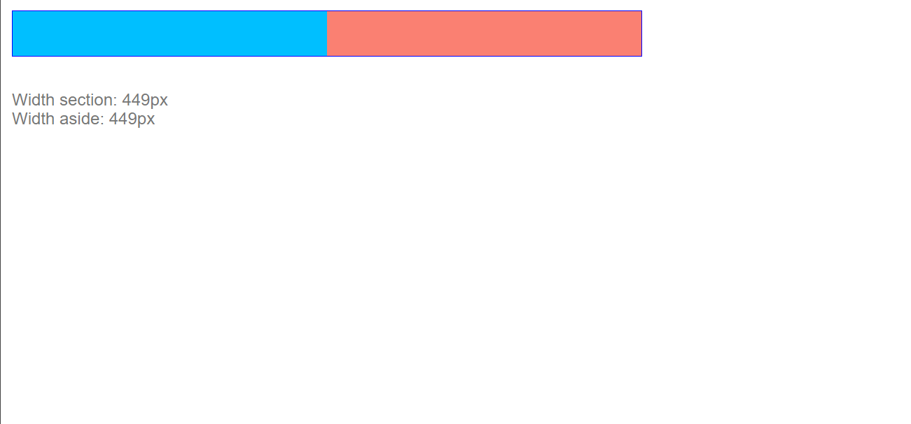

# Ejemplo de flex grow

Incialmente un contenedor flex con dos columnas (section y aside) marcadas con la clase ".col" que establece su altura
El secction es de color salmon y el aside de color azul
Además disponemos de una lista con dos items, donde cada uno de ellos nos indica el tamaño del section y del aside en pixeles

```scss
main {
    margin-bottom: 2em;
    display: flex;
    max-width:  900px;
    border: 1px solid blue;
}

section {
    background-color: deepskyblue;
}

aside {
    background-color: salmon;
}
```

Como se puede observar en la imagen ninguna de las columnas son visibles, ya que, al no disponer de contenido flexbox no les asigna ningun tamaño



En esta situación todo el ancho del contenedor es espacio disponible por lo que si a una de las columnas (aside o section) le aplicamos la propiedad flex-grow: 1, ocupará todo el espacio disponible

```scss
section {
    ...
    flex-grow: 1;
    ...
}
```



TOTAL FLEX GROW: 1
FLEX GROW DEL ITEM: 1

Si aplicamos un flex-grow: 1 a ambos items, ambos se repartirán el espacio disponible por igual

```scss
section {
    ...
    flex-grow: 1;
    ...
}

aside {
    ...
    flex-grow: 1;
    ...
}
```


TOTAL FLEX GROW: 1
FLEX GROW DE CADA ITEM: 1/2
