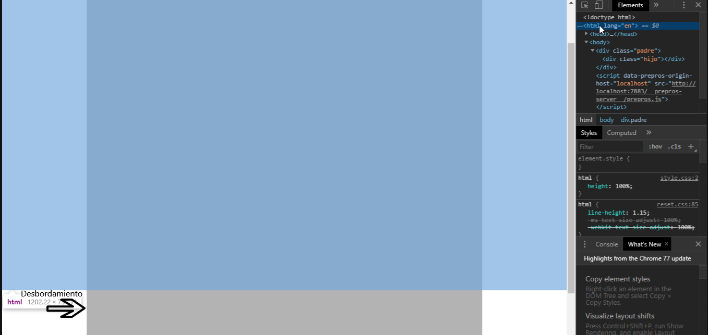

## Ejemplo con position: fixed
En el ejemplo se tienen dos elementos (cajas) una dentro de otra, ".padre" e ".hijo"
```html
<div class="padre">
    <div class="hijo"></div>
</div>
```
Para el padre se utiliza una nueva unidad de medida (Viewport Height (vh)), estableciendo al ".padre" 130vh, es decir, un 130% de la altura de la ventana, además se le establece un ancho del 70% y se centra horizontalmente mediante la propiedad **margin: auto**
```scss
.padre {
    height: 130vh; // 100vh sería el alto de la ventana
    width: 70%;
    margin: 0 auto; // Centrado horizontal
    ...
}
```
y al html se le establece una altura del 100%, de forma que podemos ver como elemento ".padre" desborda respecto del html, por lo que deberíamos tener cuidado en caso de establecer la propiedad **overflow: hidden**, ya que dejaríamos de ver su contenido desbordado
```scss
html {
    height: 100%; // El body y .padre desbordan, porque el html tiene el 100% de su padre -> la ventana
}
```


- En el **PASO 01** se establece al elemento ".hijo" una altura de 5rem y la propiedad **position: fixed**, sin embargo el elemento no se visualiza, aún teniendo altura establecida. Esto es porque la propiedad **position** con su valor **fixed** el elemento tiene la anchura de su contenido o en caso contrario es necesario establecersela.
```scss
.hijo {
    height: 5rem;
    background-color: deepskyblue;
    position: fixed; // Sin ancho ocupa lo que ocupa su contenido
}
```
Por lo que se la establecemos al 100% **PASO 02**
```scss
.hijo {
    ... 
    width: 100%; // ERROR
}
```
Sin embargo, obtenemos un efecto no deseado, ya que ese 100% es respecto a la ventana y no a su elemento ".padre"

Para solucionarlo establecemos el ancho igual que el de su padre **PASO 03**
```scss
.hijo {
    ...
    width: 100%;
}
```

