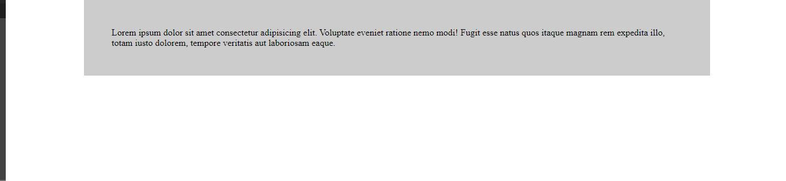

# Centrado con elemento en bloque y ancho conocido

En el ejemplo tenemos dos cajas padre (.wrapper) e hijo (.box) y se centra el elemento mediante la primera de las técnicas de centrado, que se aplica cuando el elemento a centrar tiene naturaleza de bloque y además su ancho es conocido, en este caso el 80% de su elemento padre

```html
<div class="wrapper">
    <div class="box">...</div>
</div>
```

```scss
.wrapper {
    // Wrapper es un div que tiene por su naturaliza display: block
    width: 80%; // Ancho conocido
    padding: 3rem;
    background-color: rgba(0, 0, 0, .2);
    margin-left: auto;
    margin-right: auto;
}
```



En realidad, el **margin: auto** lo que hace es repartirse el espacio sobrante
En el ejemplo también se puede ver que utilizo las dos propiedades **margin-left: auto** y el **margin-right: auto** y no el sortcuts (propiedades abreviadas) **margin: 0 auto**, esto es así por que si mas tarde aplico **margin: 4em**, estaría sobreescribiendo el **margin:left** y el **margin:right**

```scss
.wrapper {
    ...
    margin: 0 auto; // Utilizar con cuidado
}
```
