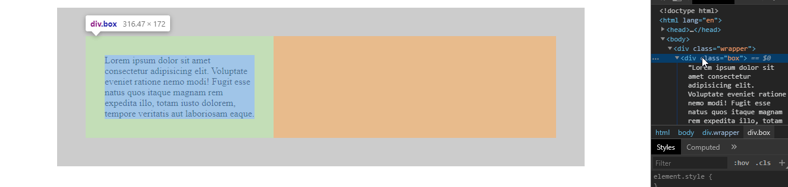
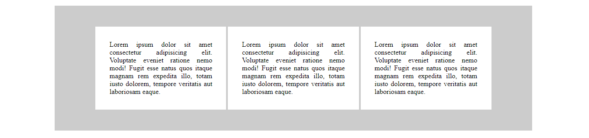

# Centrado de elementos inline-block y text-align center en el padre

En el ejemplo tenemos dos cajas padre (.wrapper) e hijo (.box) y se centra el único elemento hijo mediante la segunda técnica de centrado

```html
<div class="wrapper">
    <div class="box">...</div>
</div>
```

En primer lugar se establece el elemento interior ".box" un ancho del 40% y un padding de 2em, para formar una caja interior, que por defecto es un elemento de bloque y ocupa todo el espacio dispoible

```scss
.box {
    background-color: white;
    padding: 2em;
    width: 30%;
}
```



Para establecer el centrado horizontal, podemos establecer al elemento interno ".box" **display: inline-block** y al padre **text-align: center**, de modo que el padre ve al elemento hijo como un elemento en línea, que si puede centrar


Además si quiero que la caja interior ".box" no tenga el texto centrado, puedo establecerle su propio **text-align**, de manera que rompemos la herencia

```scss
.wrapper {
    text-align: center;
}

.box {
    display: inline-block;
    text-align: left;
}
```

Esta técnica es similar a la anterior (mediante **margin: auto**), sin embargo, con esta técnica me es posible alinear varias cajas, lo cual no es posible con **margin: auto**

```html
<div class="wrapper">
    <div class="box">...</div>
    <div class="box">...</div>
    <div class="box">...</div>
</div>
```


