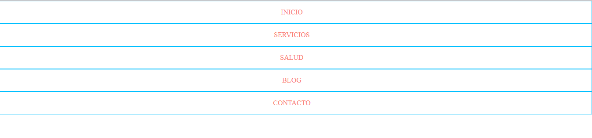
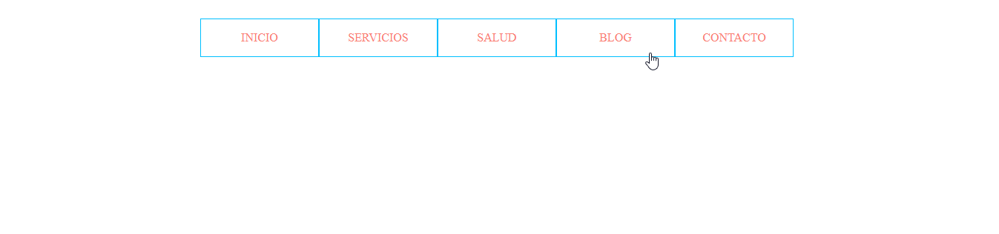

# Centrado horizontal **display: table** y **margen lateral auto**

En el ejemplo se dispone una lista no ordenada de 5 elementos dentro de un elemento "nav" (para dar semántica)

```html
<nav>
    <ul>
        <li><a href="">Inicio</a></li>
        <li><a href="">Servicios</a></li>
        <li><a href="">Salud</a></li>
        <li><a href="">Blog</a></li>
        <li><a href="">Contacto</a></li>
    </ul>
</nav>
```

```scss
nav {
    text-transform: uppercase;
    background-color: transparent;
    color: salmon;
    ul {
        ...
        li {
            text-align: center;
            border: 1px solid deepskyblue;
            ...
            a {
                padding: 1em;
                display: block;
            }
        }
    }
}
```



Las propieadades **display: table** a la etiqueta **ul** y **display: table-cell** a los **li** permiten ver la lista en forma de menu horizontal y el **margin: auto** centrar el menu

```scss
nav {
    ...
    ul {
        display: table;
        margin: auto;
        // table-layout: fixed;
        li {
            display: table-cell;
            text-align: center;
            border: 1px solid deepskyblue;
            // width: 15rem;
            a {
                padding: 1em;
                display: block;
            }
        }
    }
}
```

Los elementos del menú tienen su tamaño en función del contenido, es posible establecerles un tamaño fijo lo suficuentemente grande **width: 15rem**



También es posible como se vío en el **ejemplo 03 de la sección 04** establecer un tamaño igual a cada elemento li en función del ancho de la página con **table-layaut: fixed**, sin embargo es necesario establecer el ancho de "ul" al 100%
