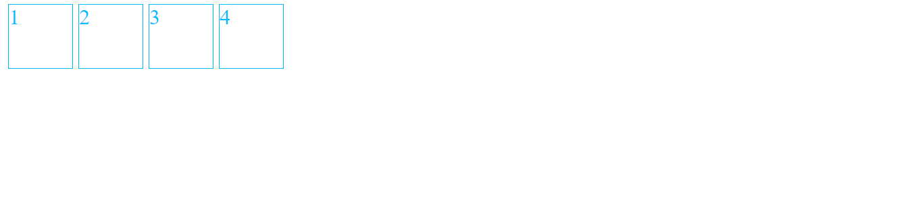
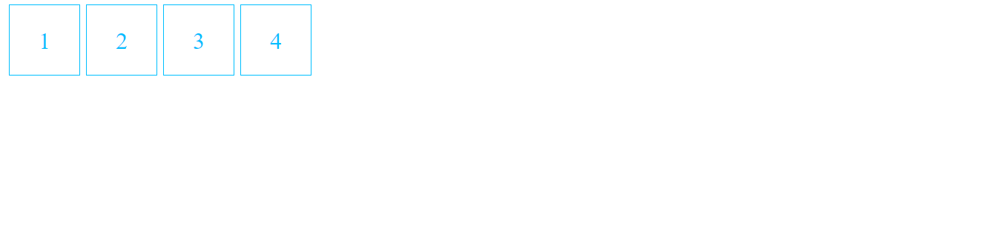

# Centrado vertical mediante line-height

Esta técnica ya vista en ejemplos anteriores solo es posible utilizarla cuando sabemos que el contenido del elemento a centrar unicamente va a tener una sola línea, como por ejemplo botones, iconos, etc

En el ejemplo tenemos cuatro cajas (botones cuadrados perfectos), la altura y anchura de la caja es de 3em (tres veces el font-size establecido en el body), además las cajas está alineadas horizontalmente mediante **display: inline-block**

```scss
.square-button {
    height: 3em;
    width: 3em;
    border: 1px solid;
    color: deepskyblue;
    display: inline-block;
}
```



Si se quiere centrar el contenido horizonalmente, simplemente podemos utilizar la propiedad **text-align: center**, y para el centrado vertical ya que el contenido de las cajas tiene una sola línea, podemos establecer la propiedad **line-height: 3em** exactamente la altura de la caja

```scss
.square-button {
    ...
    text-align: center;
    line-height: 3em;
}
```



También sería posible realizar el centrado utilizando los padding superior e inferior, sin embargo, deberíamos hacerlo a ojo dependiendiendo del font-size, con se ve en el paso siguiente

```scss
.square-button {
    border: 1px solid;
    color: deepskyblue;
    display: inline-block;
    text-align: center;
    padding: 1em 1.3em; // A ojo
}
```
