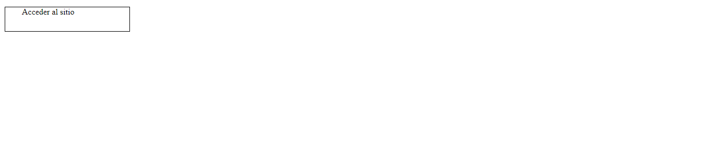
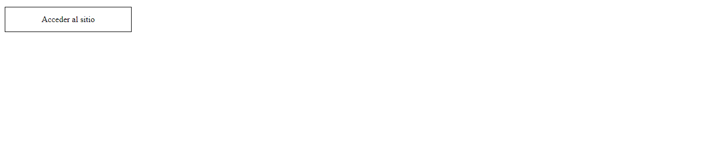

# Centrado vertical mediante display: table y vertical-align: middle
Aunque hemos visto que la propiedad **vertical-align** solo nos sirve para la alineación entre elementos **inline-block**, en combinación con **display: table** tiene un comportamiento diferente, permitiendo el centrado vertical

En el ejemplo vemos una etiqueta div simulando un botón, notar que el texto del botón tiene varias líneas por lo que no podemos utilizar la técnica de centrado anterior mediante line-height).

```html
<div class="button">
    <span>Acceder al sitio</span>
</div>
```

```scss
.button {
    border: 1px solid;
    height: 3rem;
    width: 15rem;
    padding: 0 2em;
    span {
        ...
    }
}
```



En esta situación, para el centrado horizontal podermos realizarlo mediante **text-align: center** y para la alineación vertical **display: table** y **vertical-align: middle**

```scss
.button {
    border: 1px solid;
    display: table;
    height: 3rem;
    width: 15rem;
    padding: 0 2em;

    span {
        text-align: center;
        display: table-cell;
        vertical-align: middle;
    }
}
```

