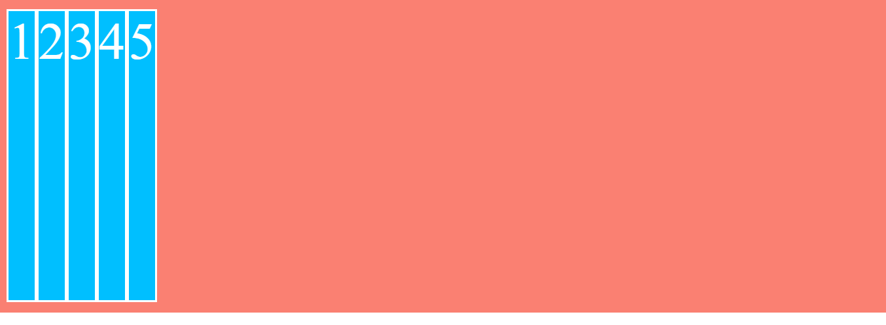
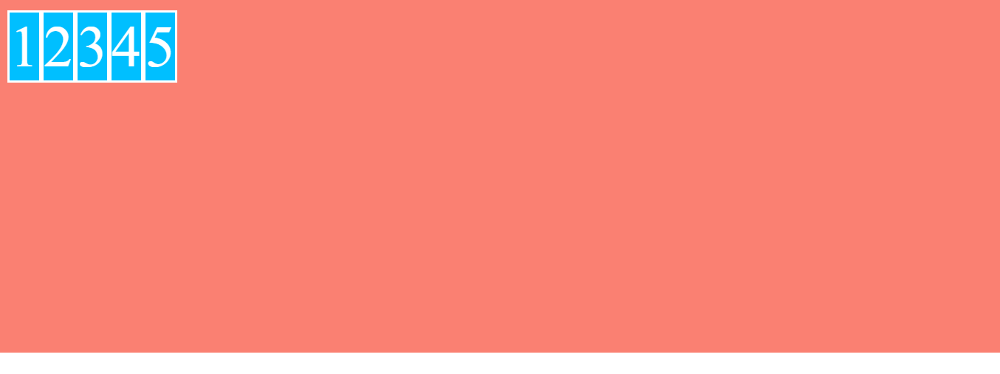
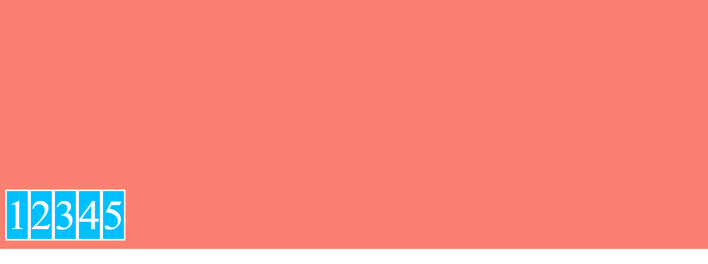
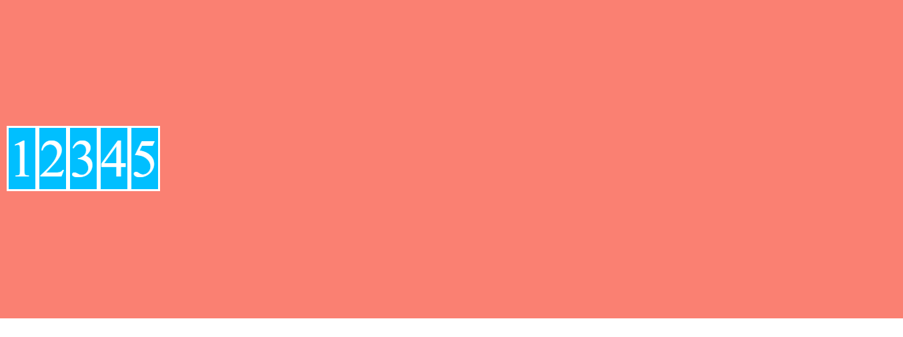
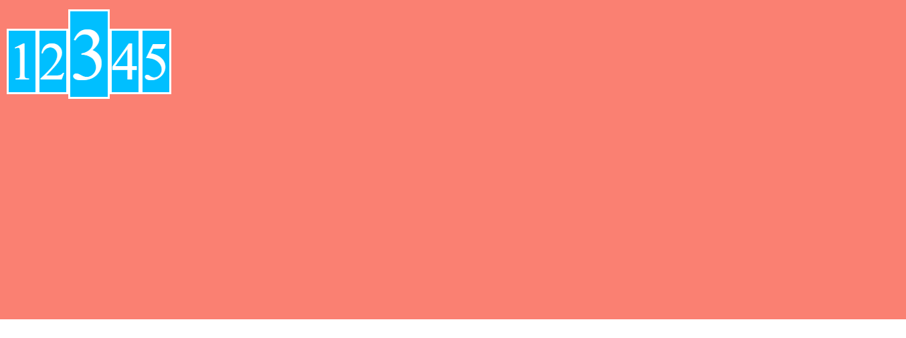

# Valores de align-items

- align-items: stretch
Los elementos se estiran para ocupar todo el alto del contenedor

```scss
.flex-container {
    ...
    display: flex;
    align-items: stretch; // Por defecto
}
```



- align-items: flex-start
Los items se alinean en la parte superior del contenedor y su altura/anchura será la de su contenido dependiendo del flex-direction

```scss
.flex-container {
    ...
    display: flex;
    align-items: flex-start; // Por defecto
}
```



- align-items: flex-end
Los items se alinean en la parte inferior del contenedor

```scss
.flex-container {
    ...
    display: flex;
    align-items: flex-start;
}
```



- align-items: center
Los items se alinean en la parte central en el eje Y

```scss
.flex-container {
    ...
    display: flex;
    align-items: center;
}
```



- align-items: baseline
Los items se alinean entre si por su línea base

```scss
.flex-container {
    ...
    display: flex;
    align-items: baseline;
}
```

