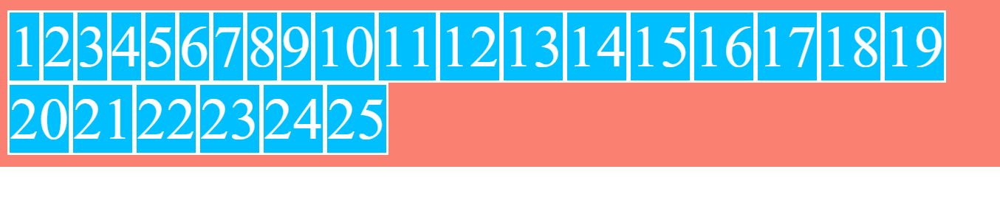
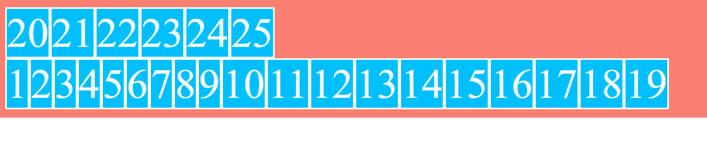

# Valores de flex-wrap

- flex-wrap: nowrap
En el ejemplo se parte del mismo contenedor anterior, pero esta vez se han añadido 25 items, el número suficiente para que desborde
La propiedad **flex-wrap** tiene como valor por defecto **nowrap** y esto hace que no permita a los items disponerse en varias líneas, y como no caben en una sola línea desbordan

```scss
.flex-container {
    ...
    display: flex;
    flex-wrap: nowrap; // Por defecto
}
```


- flex-wrap: wrap
Con esta propiedad los elementos no desbordan si el contenido no cabe dentro del contenedor, sino que se disponen en varias líneas

```scss
.flex-container {
    ...
    display: flex;
    flex-wrap: wrap;
}
```



- flex-wrap: wrap-reverse
Con este valor a diferencia del anterior si los items no caben en el contenedor, en vez de crear una línea inferior, se crea una línea superior


