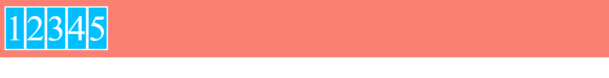
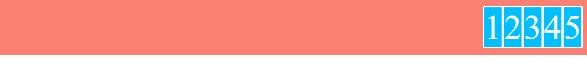

# Valores de justify-content

- justify-content: flex-start
Reparte los items elementos del contenedor al inicio del mismo, es el valor por defecto

```scss
.flex-container {
    ...
    display: flex;
    justify-content: flex-start; // Por defecto
}
```



- justify-content: flex-end
Reparte los items elementos del contenedor al final del mismo

```scss
.flex-container {
    ...
    display: flex;
    justify-content: flex-end;
}
```



- justify-content: center
Reparte los items elementos del contenedor en su centro

```scss
.flex-container {
    ...
    display: flex;
    justify-content: center;
}
```


- justify-content: space-between
Reparte el espacio entre los diferentes elementos del contenedor hasta los límites

```scss
.flex-container {
    ...
    display: flex;
    justify-content: space-between;
}
```


- justify-content: space-around
Reparte el espacio entre los diferentes elementos del contenedor

```scss
.flex-container {
    ...
    display: flex;
    justify-content: space-around;
}
```


