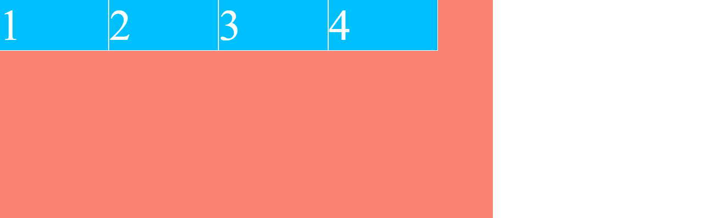
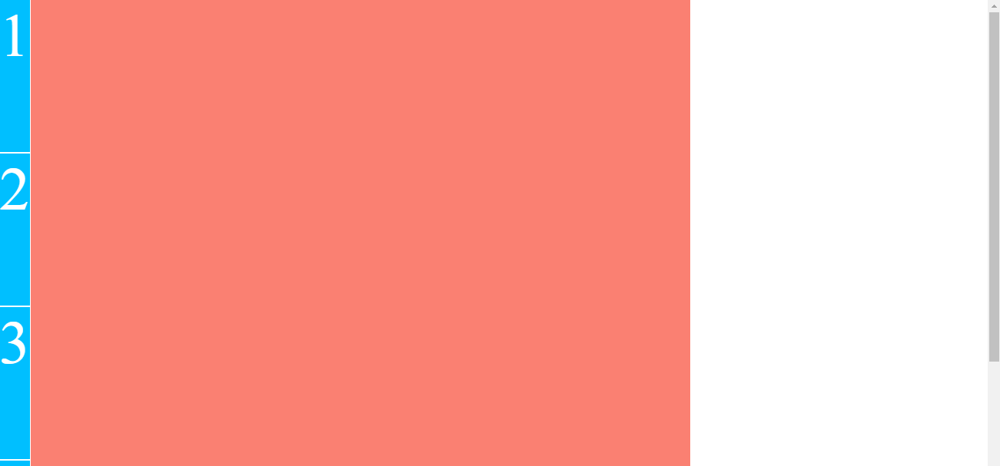

# Ejemplo de flex-basis

En el ejemplo partimos de un contenedor flexbox con cuatro flex-items, el contenedor mide 900px de alto y ancho, y los items 200px de ancho mediante flex-basis
Al tener la propiedad **align-items: flex-start** los items se alinean en la parte superior del contenedor y además pasan a ocupar su contenido (quitando el comportamiento **stretch**)

```scss
.flex-container {
    background-color: salmon;
    height: 900px;
    display: flex;
    align-items: flex-start;
    max-width: 900px;
}

.flex-item {
    font-size: 5em;
    color: white;
    background-color: deepskyblue;
    border: 1px solid;
    flex-basis: 200px; // width: 100px; Flex basis siempre gana
}
```



## STEP 01

En el paso uno cambiamos la dirección del main-axis mediante **flex-direction: column**, con lo que **flex-basis** pasa a definir la altura de los items, además la propiedad **align-items** pasa a alinear los items a la derecha

```scss
.flex-container {
    ...
    flex-direction: column;
    ...
}
```



## STEP 02

Si establezco la propiedad **align-items: end**, los items pasan a alinearse a la derecha, ya que es el end del main-axis

## STEP 03

Si establezco la propiedad **align-items: center**, los items pasan a alinearse al centro, ya que es el centro del main-axis

## STEP 04

Si establezco la propuedad **justify-content: space-between** los items se distribuiran en vertical
