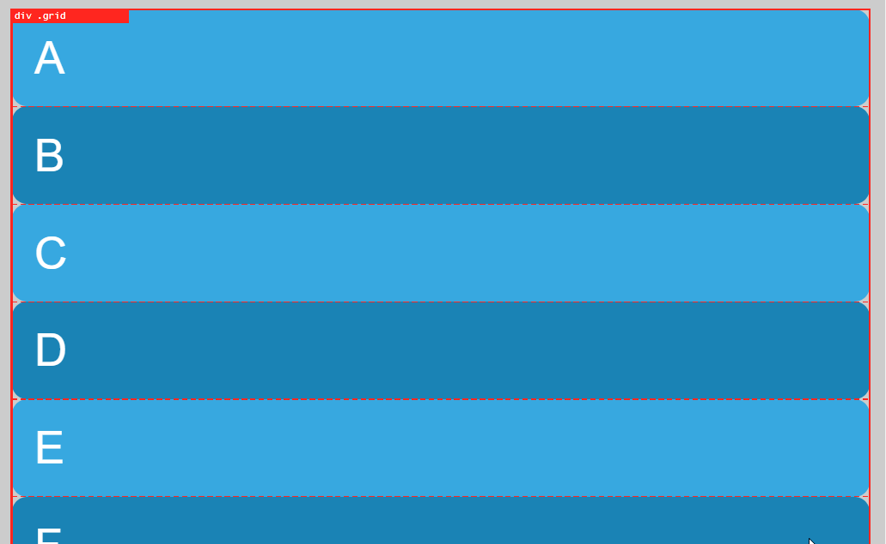
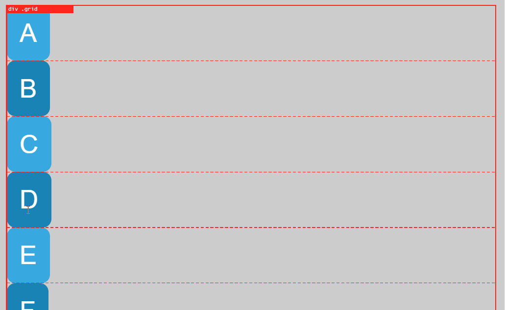

# Ejemplo de conceptos básicos

Inicialmente, en el archivo html se crean 7 cajas como elementos de bloque. La primera sección del archivo .scss solo modifica las características estéticas de las cajas.

```html
    <div class="grid">
        <div class="grid-item a">A</div>
        <div class="grid-item b">B</div>
        ...
    </div>
```

```scss
body {
    font: 3em sans-serif;
    ...
}

.grid {
    padding: 1rem;
}

...
```

En la segunda sección se asigna al elemento ".grid" la propiedad **display: grid**, aparentemente no pasa nada, sin embargo se ha generado un grid con una sola columna que crece hacia abajo tantas filas como se necesarias como items (hijos directos) tenga el elemento ".grid"

Además como dichos items tienen configurada la propiedad **justify-items: stretch** que hace que los items cojan todo el ancho disponible
Si cambio la propiedad a **justify-items: start**

```scss
.grid {
    display: grid;
    justify-items: start;
}
```

Provoca que los items se vean de la siguiente manera

