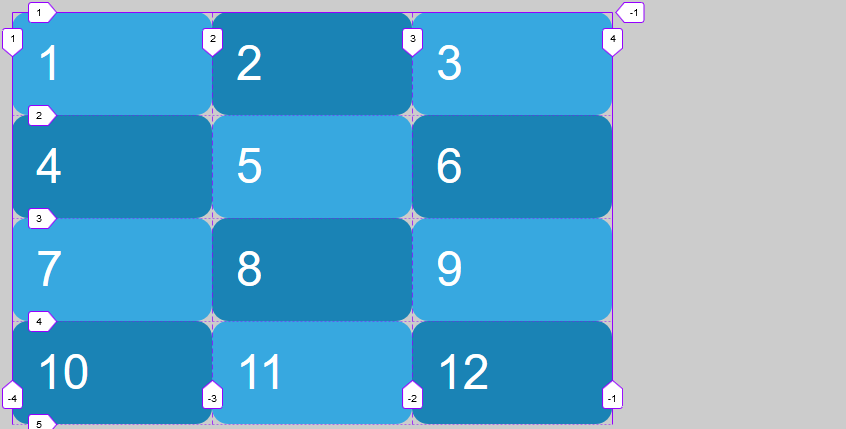
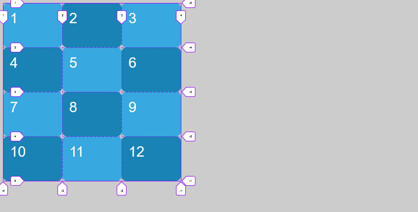
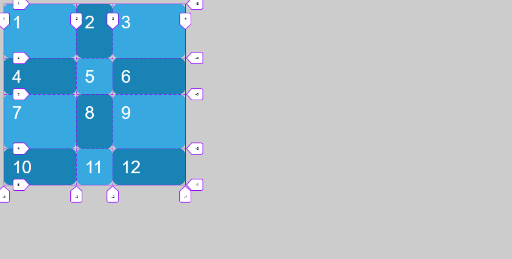

# Ejemplo: definiendo grid explícitamente

Inicialmente, en el archivo html se crean 12 cajas como elementos de bloque. La primera sección del archivo .scss solo modifica las características estéticas de las cajas.

```html
    <div class="grid">
        <div class="grid-item item1">1</div>
        <div class="grid-item item2">2</div>
        ...
    </div>
```

```scss
body {
    font: 3em sans-serif;
    ...
}

.grid {
    padding: 1rem;
}
...
```

En la segunda sección se definen las columnas de manera explicita mediante la propiedad **grid-template-column** en concreto se definen tres columnas de 200px

```scss
.grid {
    display: grid;
    grid-template-columns: 200px 200px 200px;
}
```



También podemos definir las filas (recordar que si no se definen las filas por defecto se crean), en este caso se definen cuatro filas de 150px

```scss
.grid {
    display: grid;
    grid-template-columns: 200px 200px 200px;
    grid-template-rows: 150px 150px 150px 150px;
}
```



En el paso dos definimos tamaños de filas y columnas distintos, no tienen porque ser iguales

```scss
.grid {
    display: grid;
    grid-template-columns: 200px 100px 200px;
    grid-template-rows: 150px 100px 150px 100px;
}
```



Para poder hacer espacios entre columnas tenemos la propiedad **grid-column-gap**, para filas **grid-row-gap**, para filas y columnas **grid-gap**

```scss
 .grid {
    display: grid;
    ...
    grid-gap: 1rem;
}
```


