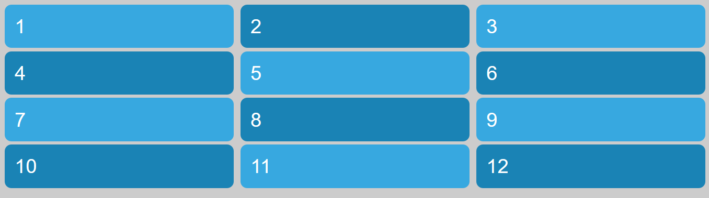
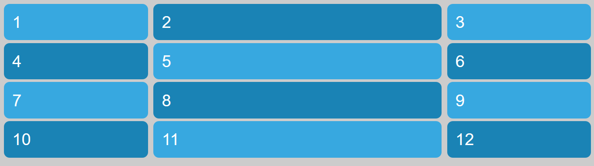
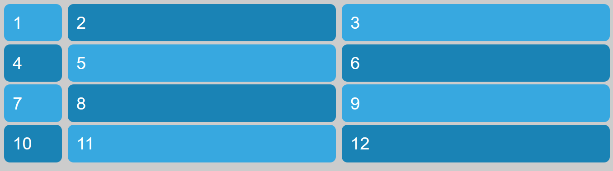
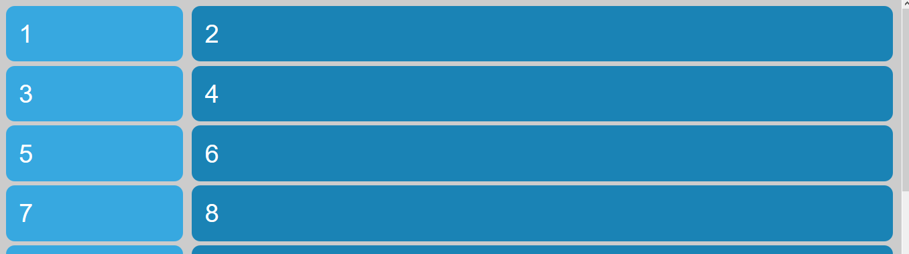
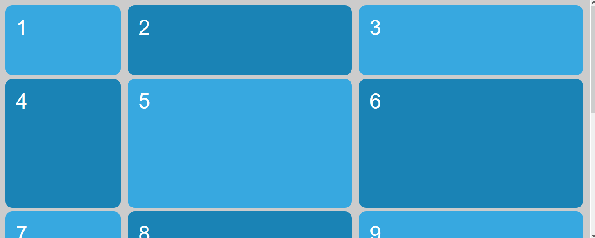

# Ejemplo: Unidad de medida FR (Fraction Unit)

Inicialmente, en el archivo html se crean 12 cajas como elementos de bloque. La primera sección del archivo .scss solo modifica las características estéticas de las cajas.

```html
    <div class="grid">
        <div class="grid-item item1">1</div>
        <div class="grid-item item2">2</div>
        ...
    </div>
```

```scss
body {
    font: 3em sans-serif;
    ...
}

.grid {
    padding: 1rem;
}
...
```

En esta ocasión creamos tres columnas con la unidad de medida **fr** que lo que a decir es que se repartan el espacio disponible

```scss
.grid {
    display: grid;
    grid-column-gap: 1rem;
    grid-row-gap: .5rem;
    grid-template-columns: 1fr 1fr 1fr;
}
```



Como la propiedad flex-grow de flexbox puede hacer que se distribuyan el espacio en diferentes proporociones como se ve en el paso 2

```scss
.grid {
    ...
    grid-template-columns: 1fr 2fr 1fr;
}
```



Puedo combinar unidades de medida fijas con fr, paso 3

```scss
 .grid {
    display: grid;
    ...
    grid-template-columns: 10rem 1fr 1fr;
}
```



Puedo combinar unidades de medida fr con %, paso 4

```scss
 .grid {
    display: grid;
    ...
    grid-template-columns: 20% 1fr;
}
```



En el paso 5, vemos como distribuir el espacio mediante fr en la altura, sin embargo para que esto surja efecto es necesario establecer la altura

```scss
.grid {
    display: grid;
    ...
    grid-template-columns: 20% 1fr 1fr;
    grid-template-rows: 10rem 1fr 1fr 1fr; // Es necesario establecer altura
    min-height: 200vh;
}
```

