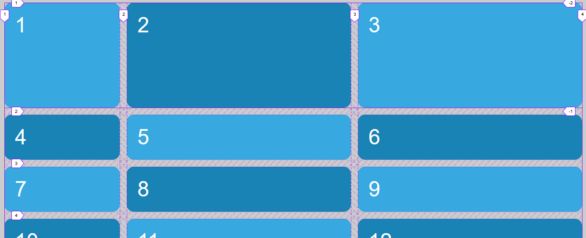

# Ejemplo usando grid-auto-rows

Inicialmente, en el archivo html se crean 12 cajas como elementos de bloque. La primera sección del archivo .scss solo modifica las características estéticas de las cajas.

```html
    <div class="grid">
        <div class="grid-item item1">1</div>
        <div class="grid-item item2">2</div>
        ...
    </div>
```

```scss
body {
    font: 3em sans-serif;
    ...
}

.grid {
    padding: 1rem;
}
...
```

A continuación se definen 3 columnas (20% 1fr 1fr) y 1 filas (15rem) tenemos que tener en cuenta que con tres columnas y la fila solo definimos un grid de 3 celdas explicitamente

```scss
.grid {
    display: grid;
    min-height: 200vh;
    grid-gap: 1rem;
    grid-template-columns: 20% 1fr 1fr;
    grid-template-rows: 15rem;
    ...
}

```

Con la propiedad **grid-auto-row** defimos el tamaño de las celdas implicitas es decir celdas que se crean para ubucar las cajas que no se pueden ubicar en las celdas que se crean explicitamente. Esto es muy utilizado cuando no sabemos de antemano el número de items hijos del grid que se van a crear (se crean por programación)

```scss
.grid {
    display: grid;
    ...
    grid-template-columns: 20% 1fr 1fr;
    grid-template-rows: 15rem;
    grid-auto-rows: max-content;
}

```


