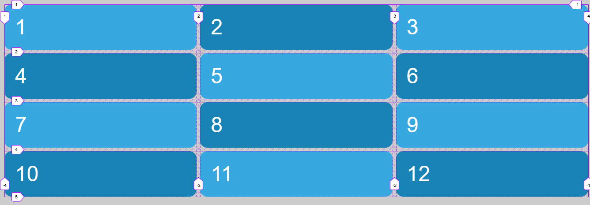
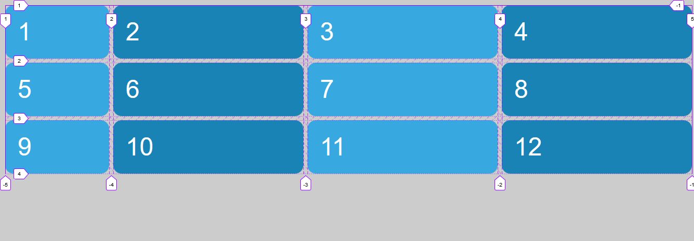

# Funciones y keywords: repeat()

Inicialmente, en el archivo html se crean 12 cajas como elementos de bloque. La primera sección del archivo .scss solo modifica las características estéticas de las cajas.

```html
    <div class="grid">
        <div class="grid-item item1">1</div>
        <div class="grid-item item2">2</div>
        ...
    </div>
```

```scss
body {
    font: 3em sans-serif;
    ...
}

.grid {
    padding: 1rem;
}
...
```

La función repeat permite repetir el número de columnas de un tamaño el número de veces indicado

```scss
.grid {
    display: grid;
    grid-gap: .5rem;
    grid-template-columns: repeat(3, 1fr); // Equivale a grid-template-columns: 1fr 1fr 1fr
}
```



```scss
.grid {
    display: grid;
    grid-gap: .5rem;
    grid-template-columns: 200px repeat(3, 1fr); // Equivale a grid-template-columns: 200px 1fr 1fr 1fr
}
```


