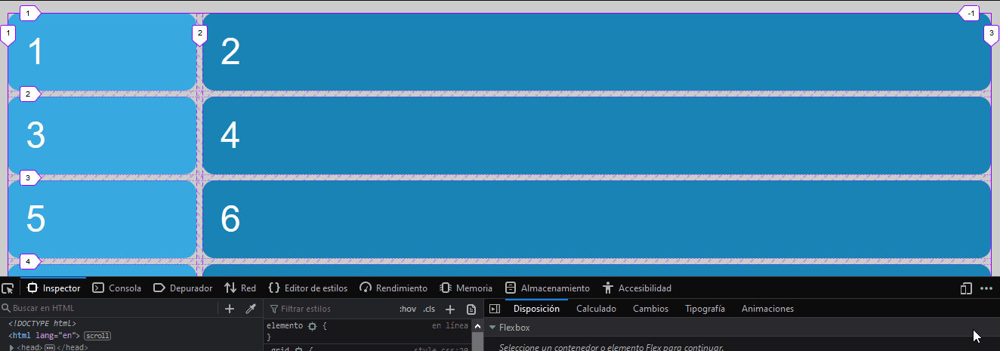

# Funciones y keywords: minmax()

Inicialmente, en el archivo html se crean 12 cajas como elementos de bloque. La primera sección del archivo .scss solo modifica las características estéticas de las cajas.

```html
    <div class="grid">
        <div class="grid-item item1">1</div>
        <div class="grid-item item2">2</div>
        ...
    </div>
```

```scss
body {
    font: 3em sans-serif;
    ...
}

.grid {
    padding: 1rem;
}
...
```

Establece el tamaño (ancho o alto) mínimo y máximo que quiero que tengan las celdas, es decir, en el ejemplo definimos dos columas la primera tiene un mínimo de 150px y un máximo 250px, y la segunda 1fr que ocupará todo el ancho disponible, con lo que la primera columna ocupará todo lo que pueda hasta los 250px que tiene de máximo y cuando ya no haya espacio disponible comenzará a reducir su ancho hasta el mínimo de 150px

```scss
.grid {
    display: grid;
    grid-gap: .5rem;
    grid-template-columns: minmax(150px, 250px) 1fr;
    // grid-template-columns: minmax(150px, 20%) 1fr;
}
```



 Nota: Los fr no se pueden poner en **grid-gap**, ni como **minimo en la función minmax()**
