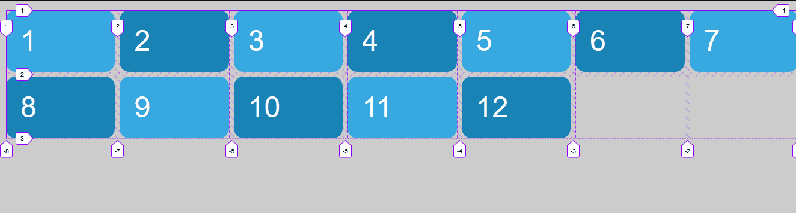

# Funciones y keywords: auto-fill y auto-fit

Inicialmente, en el archivo html se crean 12 cajas como elementos de bloque. La primera sección del archivo .scss solo modifica las características estéticas de las cajas.

```html
    <div class="grid">
        <div class="grid-item item1">1</div>
        <div class="grid-item item2">2</div>
        ...
    </div>
```

```scss
body {
    font: 3em sans-serif;
    ...
}

.grid {
    padding: 1rem;
}
...
```

Autofil y autofit no son funciones nuevas, son valores/keywords que yo puedo aplicar a la función repeat()

- Autofill significa relleno automático
- Autofit significa ajuste automático

Los valores auto-fill y auto-fit sustituyen el número de columnas/filas en la función repeat(), por un número determinado de columnas, este número vendrá calculado por el número de columnas que caben para la medida dada en la función repeat()

```scss
.grid {
    display: grid;
    grid-gap: .5rem;
    grid-template-columns: repeat(auto-fill, 15rem);
}
```


Como vemos en la imagen se crean cinco columnas de 15rem, si disminuimos la pantalla el número de columnas se reduce y aumenta el número de filas


Podemos combinarlo con la función mimmax() de manera que los items van creciendo o disminuyendo hasta que llega un momento en que cabe otro item (deplazandolo hacia arriba), o es necesario eliminarlo (deplazandose hacia abajo)

```scss
.grid {
    display: grid;
    grid-gap: .5rem;
    grid-template-columns: repeat(auto-fill, minmax(10rem, 1fr));
}
```


En el momento que entra un track nuevo de 10rem los sube hasta que no entra estira los demás para que me ocupen todo el espacio y no quede hueco

Notas:

1. Auto-fill y auto-fit no los puedo combiar ni con auto ni con fr, a no ser que esten dentro de un minmax() donde se establece el tamaño mínimo
2. Si tenemos varios repeat solamente uno puede tener auto-fill y auto-fit
3. Si tenemos un minmax con dos medidas absolutas siempre coge el máximo
