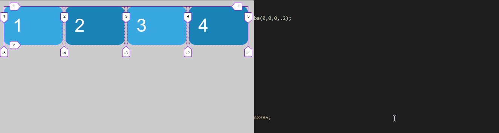
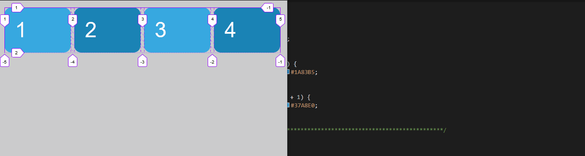

# Diferencias entre auto-fill y auto-fit

Cuando no tenemos elementos suficientes para rellenar el ancho del contenedor, auto-fit sigue generando tracks aunque no menta ningún elemento dentro de ese track

```scss
.grid {
    display: grid;
    grid-gap: .5rem;
    grid-template-columns: repeat(auto-fill, minmax(150px, 1fr));
}
```



Mientras que auto-fit no genera ningún track más aunque estire los tracks existentes hasta llenar el ancho del contenedor

```scss
.grid {
    display: grid;
    grid-gap: .5rem;
    grid-template-columns: repeat(auto-fit, minmax(150px, 1fr));
}
```


