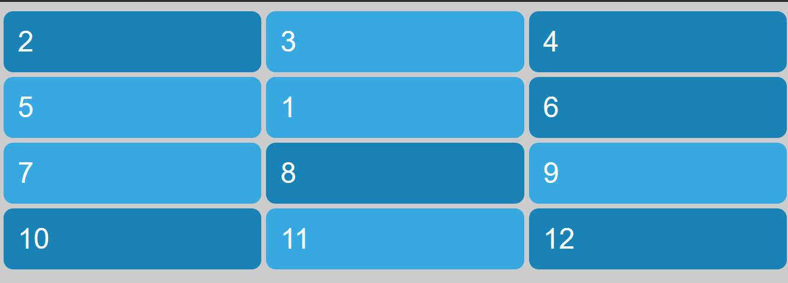
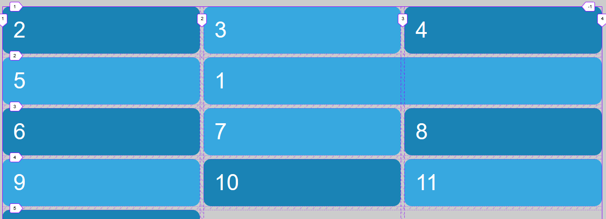

# Posicionamiento de los items

Las propiedades:

- **grid-column-start**. Define la línea horizontal donde se colocará el item de comienzo
- **grid-column-end**. Define la línea horizontal donde terminará el item
- **grid-row-start**. Define la línea vertical donde se colocará el item de comienzo
- **grid-row-end**. Define la línea vertical donde se terminará el item

Por ejemplo, partiendo de la situación de ejemplo asteriores con 12 items, podemos definir la posición del primer item en la coordenada (2, 2) del grid

```scss
.item1 {
    grid-column-start: 2; // Sobre las líneas no sobre los tracks
    grid-column-end: 3; // No es necesario, por defecto
    grid-row-start: 2; // Sobre las líneas no sobre los tracks
    grid-row-end: 3; // No es necesario, por defecto
}
```



Mediante estas propiedades también puedo expandir los items, haciendo que ocupen varias celdas, por ejemplo, podemos hacer que el "item1" ocupe las coordenadas (2,2) y (2,3) del grid

```scss
 .item1 {
    grid-column-start: 2;
    grid-column-end: 4;
    grid-row-start: 2;
    grid-row-end: 3;
}
```



Tenemos diferentes shorthands

```scss
.item1 {
    grid-column: 2/4;
    grid-row: 3/5;
}
```


Mediante la colocación de items en celdas y su expansión es posible que generemos huecos y por consiguiente tracks implicitos

```scss
.item1 {
    grid-column: 2/4;
}
```


También es posible utilizar la palabra "span" para la extensión de los items

```scss
.item1 {
    grid-column: span 2; // Desde donde le toca se expande 2 tracks
    // Tambien grid-column: 1/span 2;
}
```


También es posible utilizar números de línea negativos, útil cuando no sabemos el número de columnas

```scss
.item1 {
    grid-column: 1/-1;
```


También es posible generar tracks implicitos si indicamos números de líneas fuera del rango establecido

```scss
.item1 {
    grid-column: 2/5;
}
```


Para solucionar los huecos que genera el posicionamiento de los items podemos utilizar la propiedad **grid-auto-flow: dense**

```scss
.grid {
    grid-auto-flow: dense;
}

.item1 {
    grid-column: 2;
}
```


Podemos utilizar otro shorthand con la propiedad **grid-area: row-start/column-start/row-end/column-end**

```scss
.item1  {
    // row-start/column-start/row-end/column-end;
    grid-area: 1/2/3/-1;
}
```


Los items pueden superponerse si a dos o más items se les establece las mismas coordenadas

```scss
.item1 {
    grid-area: 1/2/3/-1;
}

.item6 {
    grid-area: 1/2/3/-1;
}
```


