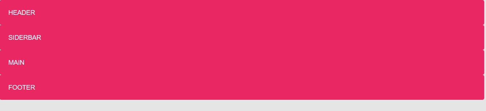
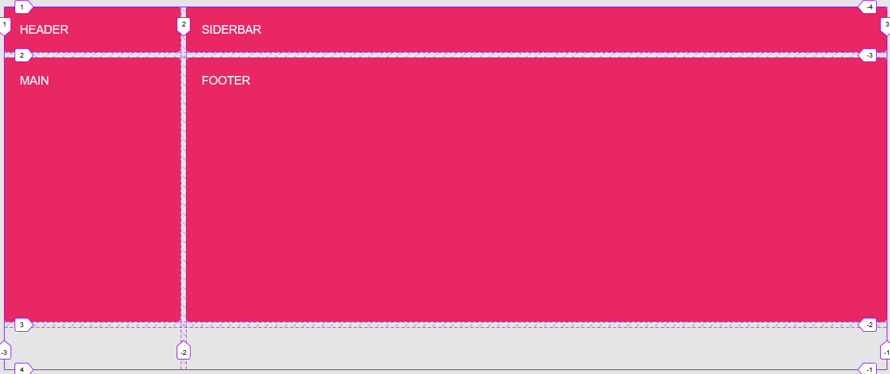
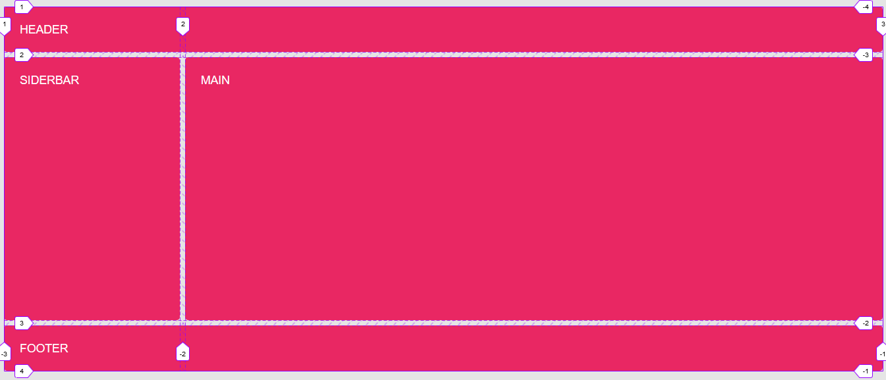
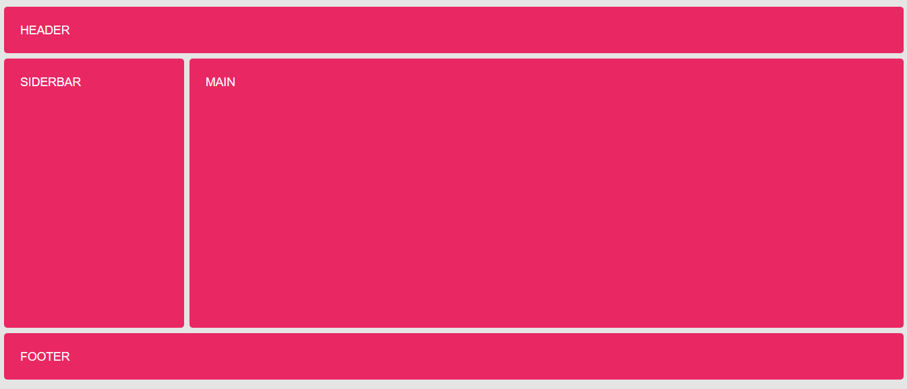
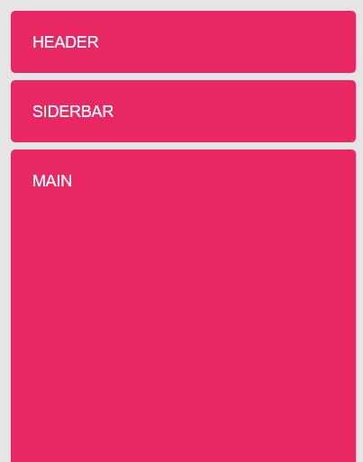

# Ejemplo de líneas nombradas

Partimos inicialmente de un contenedor ("grid") con cuatro cajas (header, aside, main y footer), a los que no se les aplica ninguna de las propiedades de **grid-layout** por lo que tendrán un comportamiento de bloque

```html
<div class="grid">
    <header class="gird-item header">Header</header>
    <aside class="grid-item sidebar">Siderbar</aside>
    <main class="grid-item main">Main</main>
    <footer class="grid-item footer">Footer</footer>
</div>
```

```scss
body {
    background-color: rgba(0,0,0, .1);
    font: 1.1rem sans-serif;
    text-transform: uppercase;
    color: white;
}

.grid {
    padding: 1rem;
}

.grid-item {
    padding: 1.5rem;
    border-radius: .3rem;
    background-color: #E92763;
}
```



Vamos a hacer un layout típico con el header arriba el aside a un lado el main al otro y el footer abajo. Para ello en primer lugar establecemos el grid de 2 columnas y tres filas con las siguientes características

```scss
.grid {
    display: grid;
    gap: .5rem;
    grid-template-columns: minmax(150px, 20%) 1fr;
    grid-template-rows: minmax(4rem, auto) 400px minmax(4rem, auto);
}
```



Observar que nos quedan dos celdas vacías en la última fila del grid

Para colocarlos no tenemos más que indicar que el header y el footer ocupen desde la línea 1 a la 3 vertical

```scss
...

header, footer {
    grid-column: 1/3;
}
```



Sin embargo, nosotros vamos a utilizar líneas nombradas, para ello ponemos entre la definición de los tracks el nombre de la línea entre corchetes

```scss
.grid {
    display: grid;
    gap: .5rem;
    grid-template-columns: [start] minmax(150px, 20%) [main] 1fr [end];
    grid-template-rows: [header] minmax(4rem, auto) [main] 400px  [footer] minmax(4rem, auto) [end];
}
```

Ahora podemos expandir los items utilizando el nombre de las lineas

```scss
header, footer {
    grid-column: start/end;
}
```

El resultado será el mismo



Hasta ahora la utilidad de esto, es más bien poca, ya que no aporta una ventaja significativa, sin embargo, si que apreciamos la ventaja en el resposive

```scss
@media screen and (max-width: 500px) {
    .grid {
        grid-template-columns: [start] 1fr [end];
        grid-template-rows: [header] minmax(4rem, auto) [sidebar] minmax(4rem, auto) [main] 400px  [footer] minmax(4rem, auto) [end];
    }
}
```



He modificado el grid, pero no he tenido que recolocar ninguna línea, esto no hubiese sido posible si lo hubiera hecho con los números de línea **grid-column: 1/3**, ya que la línea 3 dejaría de existir explicitamente y la generaría implicitamente

Ejercicio añadir un sidebar2
