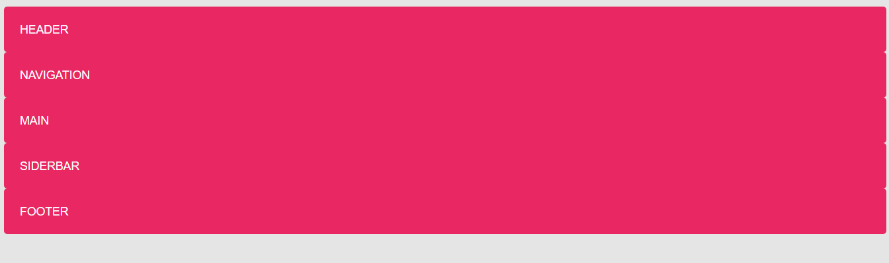
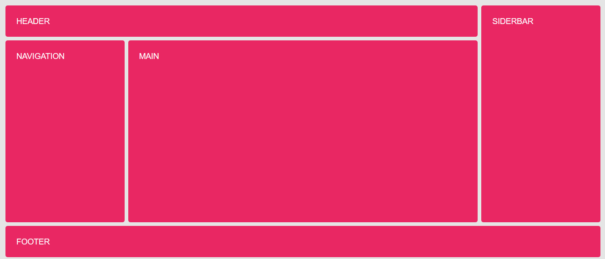

# Ejemplo de líneas nombradas con nombres múltiples

Partimos inicialmente de un contenedor ("grid") con cinco cajas (header, nav,  main, aside y footer), a los que no se les aplica ninguna de las propiedades de **grid-layout** por lo que tendrán un comportamiento de bloque

```html
<div class="grid">
    <header class="gird-item header">Header</header>
    <aside class="grid-item sidebar">Siderbar</aside>
    <main class="grid-item main">Main</main>
    <footer class="grid-item footer">Footer</footer>
</div>
```

```scss
body {
    background-color: rgba(0,0,0, .1);
    font: 1.1rem sans-serif;
    text-transform: uppercase;
    color: white;
}

.grid {
    padding: 1rem;
}

.grid-item {
    padding: 1.5rem;
    border-radius: .3rem;
    background-color: #E92763;
}
```



Para nombrar las líneas de distintas maneras

```scss
.grid {
    display: grid;
    gap: .5rem;
    grid-template-columns: [first nav-start] minmax(200px, 20%)
                           [nav-end main-start] 1fr
                           [main-end sidebar-start] minmax(200px, 20%) [sidebar-end last];
    grid-template-rows: [first header-start] minmax(4rem, auto)
                        [header-end main-start] 1fr
                        [main-end footer-start] minmax(4rem, auto) [footer-end last];
}
```

Y la colocación de los items la hago con los diferentes nombres

```scss
.header {
    grid-column: first / sidebar-start;
}

.nav {
    grid-column: nav-start / nav-end;
}

.sidebar {
    grid-column: sidebar-start / sidebar-end;
    grid-row: header-start / footer-start;
}

.footer {
    grid-column: first / last;
}
```


