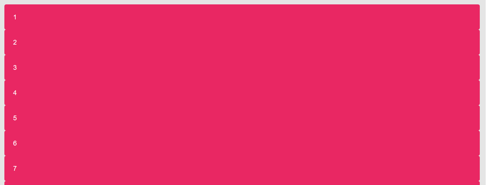
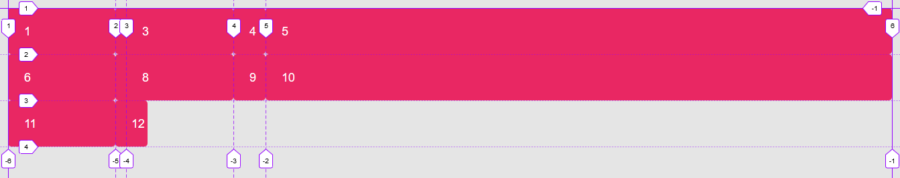

# Ejemplo de líneas nombradas con nombres repetidos

Partimos inicialmente de un contenedor ("grid") con cinco cajas (header, nav,  main, aside y footer), a los que no se les aplica ninguna de las propiedades de **grid-layout** por lo que tendrán un comportamiento de bloque

```html
<div class="grid">
    <header class="gird-item header">Header</header>
    <aside class="grid-item sidebar">Siderbar</aside>
    <main class="grid-item main">Main</main>
    <footer class="grid-item footer">Footer</footer>
</div>
```

```scss
body {
    background-color: rgba(0,0,0, .1);
    font: 1.1rem sans-serif;
    text-transform: uppercase;
    color: white;
}

.grid {
    padding: 1rem;
}

.grid-item {
    padding: 1.5rem;
    border-radius: .3rem;
    background-color: #E92763;
}
```



En el ejemplo tratamos de generar un grid con espacio entre celdas de distintos tamaños, como no es posible tal y como está la especificación, utilizadomos tracks horizontales para simular espacios en blanco

```scss
.grid {
    display: grid;
    grid-template-columns: [col] 10rem [gap] 1rem [col] 10rem [gap]3rem [col] 1fr;
}
```

Como vemos en el cógido las columnas dirigidas a contenido se nombran con el identificador **col** (en el ejemplo tres columnas) y las columnas destinadas a ser espacios en blanco las nombramos con el identificador **gap** (en el ejemplo dos columnas), según esto, los nombres de algunas columnas se repiten



Podemos seleccionar una columna repetida con su identificador y su número de posición con ese nombre

```scss
.item1 {
    grid-column: col 2;
}
```

de esta manera estaremos diciendo que se situe en la segunda línea que se llame "col"
