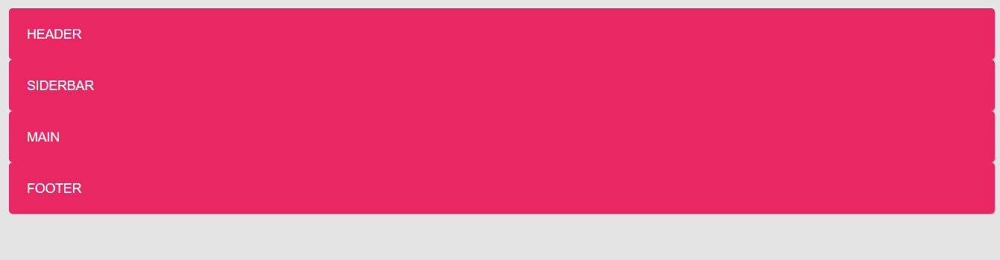
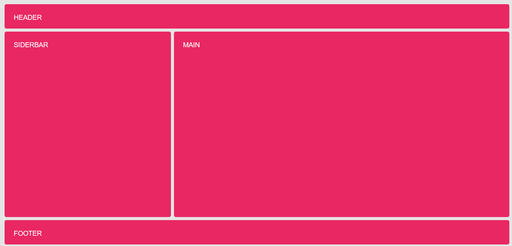
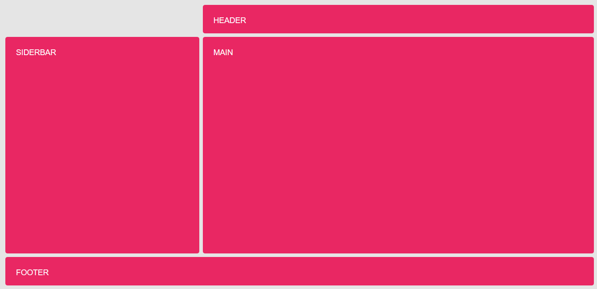

# Ejemplo de areas nombradas

Partimos inicialmente de un contenedor ("grid") con cuatro cajas (header, aside, main y footer), a los que no se les aplica ninguna de las propiedades de **grid-layout** por lo que tendrán un comportamiento de bloque

```html
<div class="grid">
    <header class="gird-item header">Header</header>
    <aside class="grid-item sidebar">Siderbar</aside>
    <main class="grid-item main">Main</main>
    <footer class="grid-item footer">Footer</footer>
</div>
```

```scss
body {
    background-color: rgba(0,0,0, .1);
    font: 1.1rem sans-serif;
    text-transform: uppercase;
    color: white;
}

.grid {
    padding: 1rem;
}

.grid-item {
    padding: 1.5rem;
    border-radius: .3rem;
    background-color: #E92763;
}
```



Podemos definir el layout de otra manera medinate la propiedad **grid-template-areas**, de manera que definimos las filas y columnas mediante identificadores, es decir, indicamos para cada fila una lista de identificadores, si queremos que una celda ocupe más celdas le damos el mismo identificador

```scss
.grid {
    display: grid;
    ...
    grid-template-columns: repeat(3, 1fr);
    grid-template-areas:
        "header header header"
        "sidebar main main"
        "footer footer footer";
    ...

}
```

y asignamos a cada item el identificador mediante la propiedad

```scss
.header {
    grid-area: header;
}

.sidebar {
    grid-area: sidebar;
}

.main {
    grid-area: main;
}

.footer {
    grid-area: footer;
}
```



Si queremos he alguna de las celdas no tenga contenido, basta con sustituir el identificador del elemento por un .

```scss
.grid {
    ...
    grid-template-areas:
        ". header header"
        "sidebar main main"
        "footer footer footer";
    ...
}
```


