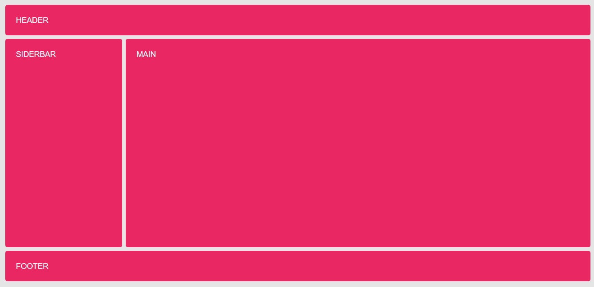
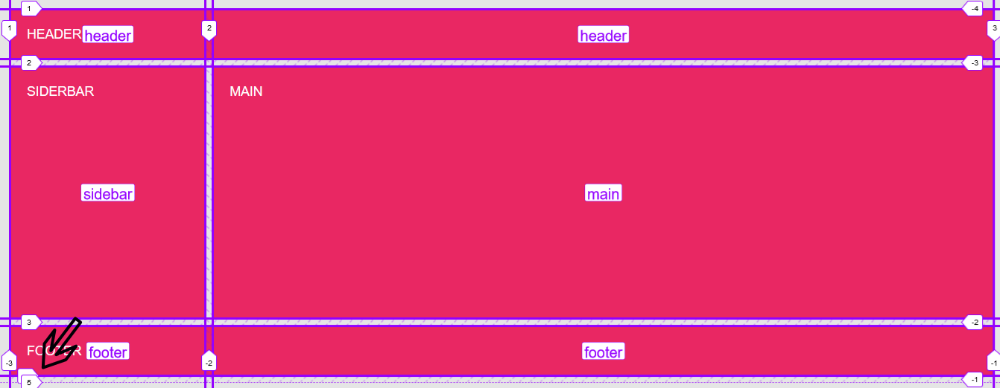
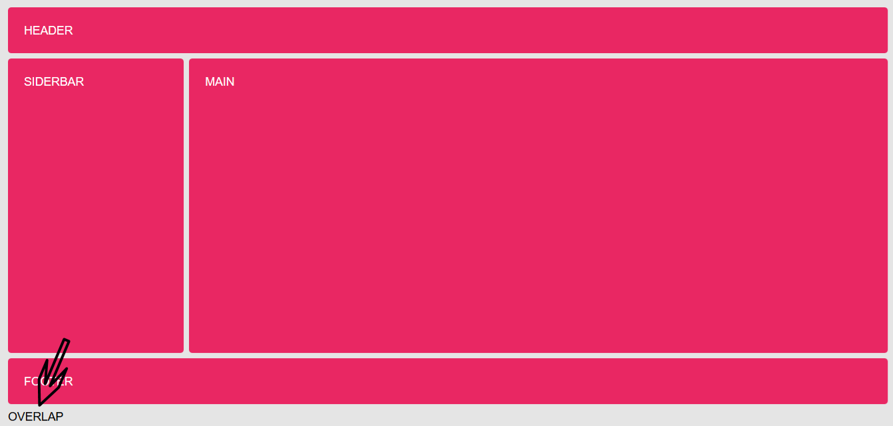
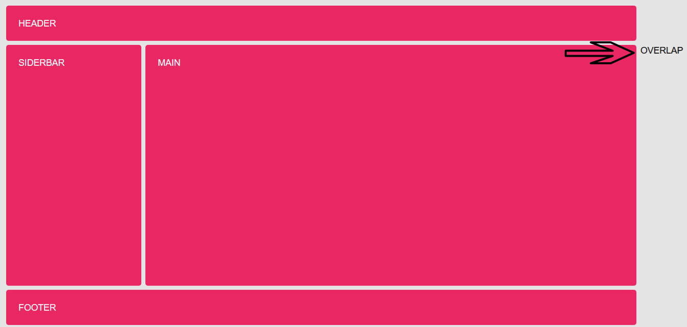
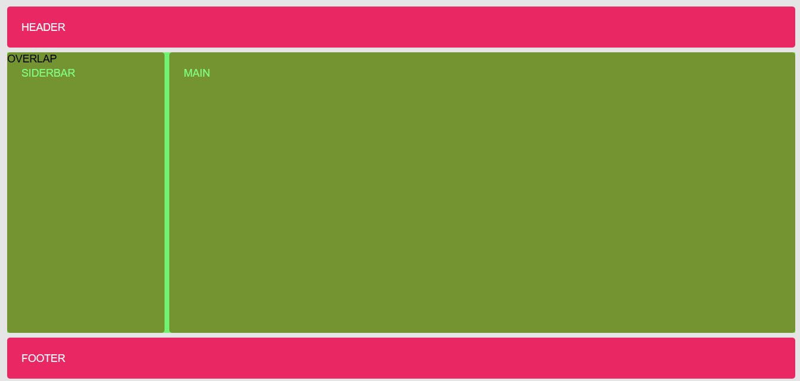

# Ejemplo de Magic Lines

Partimos de la situación de un layout común con el header arriba, un sidebar a la izquierda, un main a la derecha y finalmente un footer en la parte inferior



Este grid ha sido definido mediante un grid area, de la siguiente manera

```html
<div class="grid">
    <header class="grid-item header">Header</header>
    <aside class="grid-item sidebar">Siderbar</aside>
    <main class="grid-item main">Main</main>
    <footer class="grid-item footer">Footer</footer>
</div>  
```

```scss
.grid {
    display: grid;
    min-height: 100vh;
    gap: .5rem;
    grid-template-columns: minmax(150px, 20%) 1fr;
    grid-template-rows: minmax(4rem, auto) 1fr minmax(4rem, auto);
    grid-template-areas:
        "header header"
        "sidebar main"
        "footer footer";
}

.header {
    grid-area: header;
}
...
```

A este grid le añadimos un grid-item más:

```html
<div class="grid">
    ...
    <footer class="grid-item footer">Footer</footer>
    <div class="overlap-item"></div>
</div>
```

Este grid genera un número de línea y track implicitos. El track no se llega a visualizar ya que no tiene contenido



Podemos añadir contenido a este item para ver que se coloca implicitamente debajo, creando un nuevo track

```html
<div class="grid">
    ...
    <footer class="grid-item footer">Footer</footer>
    <div class="overlap-item">OVERLAP</div> <!-- En el ejemplo es necesario establecer el color negro-->
</div>
```



Si tenemos areas definidas podemos utilizar nombres de líneas no definidos por nosotros, sino que son automáticamente creados cuando definimos el grid-area

```scss
.overlap-item {
    color: black;
    grid-row: header-end/footer-start;
}
```

La intención es superponer este item sin embargo como no hemos definido las columnas donde situarse, solamente las filas, el item se coloca en el lateral derecho del grid



Para provocar la superposición necesitamos definir la fila y columna:

```scss
.overlap-item {
    color: black;
    background-color: rgba(0, 255, 0, .5);
    grid-row: header-end/footer-start;
    grid-column: sidebar-start / main-end;
}
```



Por tanto puedo superponer items utilizando números de línea no creados por nosotros y generados implicitamente cuando generamos el area
