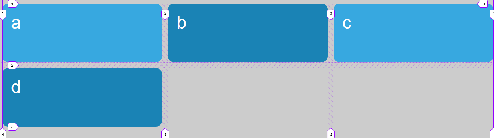
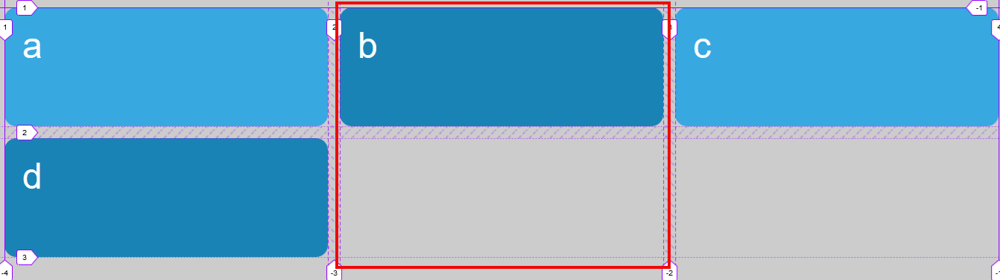
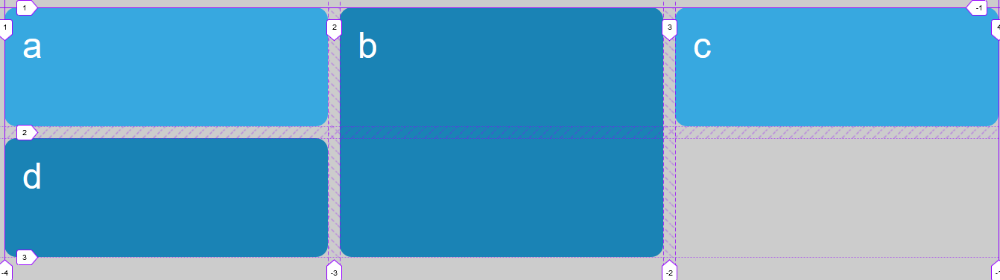
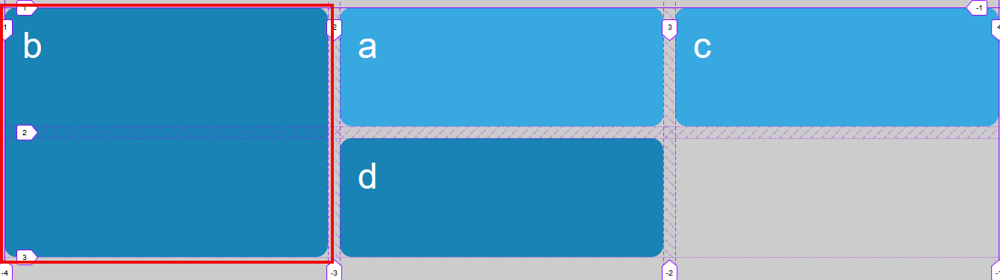

# Autoplecement + grid-column / grid-row

Se parte cuatro elementos dispuestos en un grid de tres columnas (las columnas se reparten el espacio disponible) que crece automáticamente añadiendo más filas

```html
<div class="grid">
    <div class="grid-item a">a</div>
    <div class="grid-item b">b</div>
    <div class="grid-item c">c</div>
    <div class="grid-item d">d</div>
</div>
```

```scss
.grid {
    display: grid;
    padding: 1rem;
    gap: 1rem;
    grid-template-columns: repeat(3, 1fr);
    grid-auto-rows: 10rem;
}
```



Queremos que el item b ocupe dos filas:



Esto podemos hacerlo de diversas maneras que hemos visto en ejemplos anteriores

```scss
.b {
    grid-row-start: span 2; // span 2 / auto;
    grid-row: span 2;
    grid-row-end: span 2; // auto / span 2;
```



Sin embargo, si utilizo solamente los números de línea como en los siguientes códigos

```scss
.b {
    grid-row: 1 / 3; // Y aquí se nos ropen los esquemas
    grid-row: auto / 3; // Y aquí mas problemas
    grid-row: 1 / auto; // Y más
}
```

El grid se comporta de manera no esperada, situando el item "b" en la primera celda, ...



Esto se debe a que el algoritmo de autoplacement sigue una serie de normas, concretamente, este algoritmo situará los elementos siguiendo explicitamente este orden:

- Los items con la posición definida, es decir, defino la fila y la columna explicitamente donde quiero que esté
- Items con posición en el eje principal distinto de auto
- Resto de items

Nota: Cuando yo le pongo span estoy poniendo las coordenadas end y start en auto
[Especificación de grid layout](https://www.w3.org/TR/css-grid-1/)
